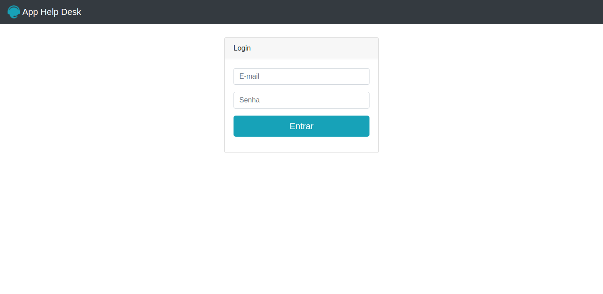
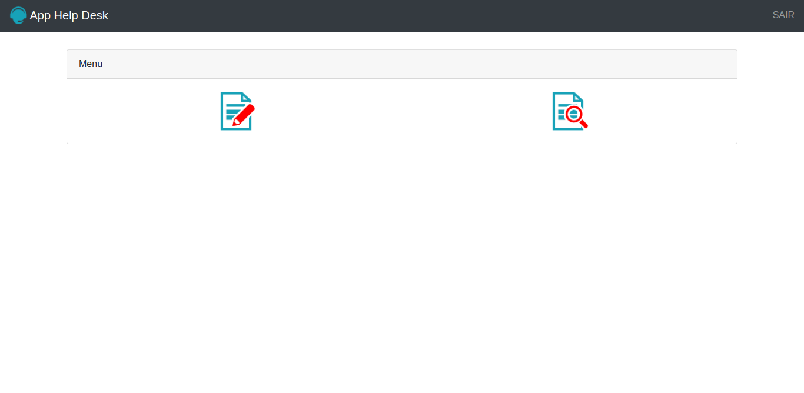
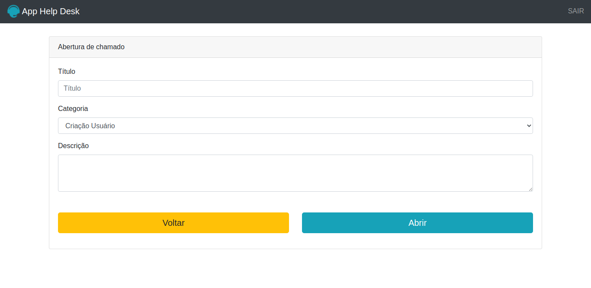
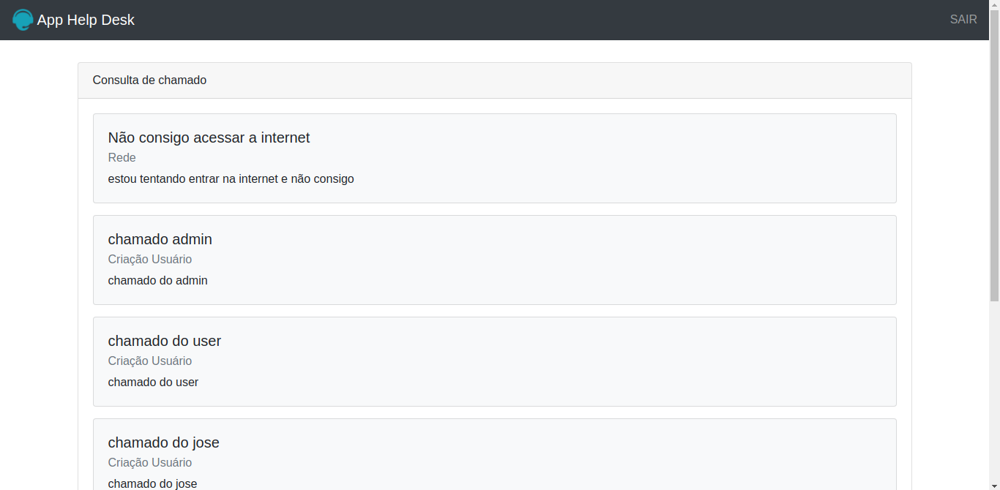

<h1 align="center">App Help Desk</h1>
<h2>&#x1F4D2; Sobre:</h2>

App Help Desk foi o projeto final da seção 11 de introdução a PHP do curso de <a href="https://www.udemy.com/course/web-completo/">desenvolvimento web</a>. O objetivo principal foi <b>praticar a linguagem PHP</b>. As funções do App Help Desk permitem abrir chamados e consultar os chamados que foram abertos basicamente.&#x1F61C;&#x1F61C;&#x1F61C;

 
<h2 align="center">&#x1F6A7 App Help Desc finalizado &#x1F6A7</h2>
 

<h2>&#x1F6E0 Demonstrações:</h2>
 

  

  

  

 

<h2>&#x1F6E0 Tecnologias:</h2>

As seguintes ferramentas foram usadas na construção do App Help Desk:

<ul>
    <li><a href="https://www.php.net/manual/pt_BR/intro-whatis.php">PHP</a></li>
    <li><a href="https://www.w3schools.com/html/html_intro.asp">HTML</a></li>
    <li><a href="https://www.w3schools.com/css/css_intro.asp">CSS</a></li>
</ul>

 
<h2>&#x1F4CC Funcionalidades:</h2>

As seguintes funcionalidades foram usadas no App Help Desk:

<ul>
    <li>Abrir chamados</li>
    <li>Consultar chamados</li>
    <li>Validar login</li>
    <li>Permissão de visualização definida pelo tipo de usuario (Administrador ou Usuario)</li>
</ul>

 
<h2>&#x1F464 Autor</h2>
<h3>Douglas Alisson</h3>

Feito com &#x1F499 por Douglas Alisson &#x1F44B Entre em contato!

 

## 📝 Licença

Este projeto esta sobe a licença [MIT](./LICENSE).
